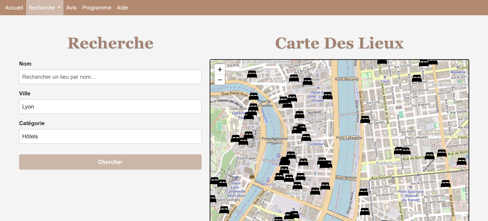
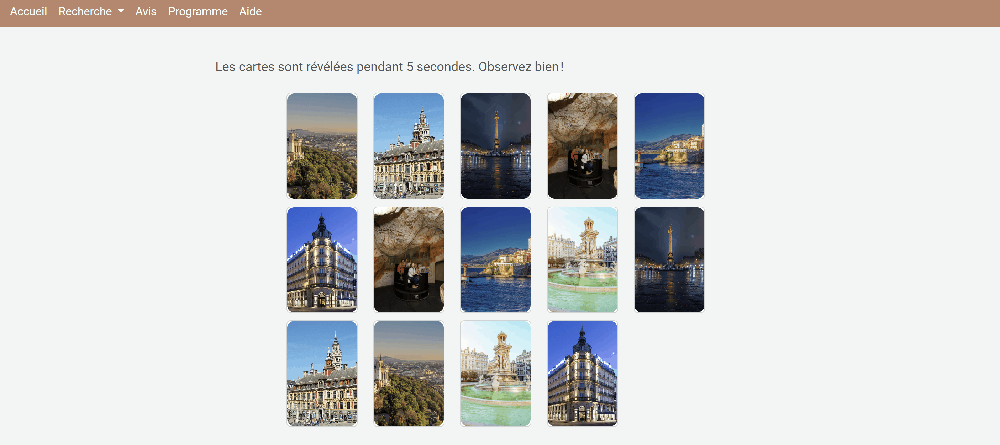

# ANAC – Application de tourisme en France

  

---

## Table des matières
- [Description du projet](#description-du-projet)
- [Technologies utilisées](#technologies-utilisées)
- [Aperçu de l'application](#aperçu-de-lapplication)
- [Auteures](#auteures)
- [Progression du projet](#progression-du-projet)

---

## Description du projet

**ANAC** est une application dédiée aux touristes souhaitant découvrir la France à travers  
des **hôtels**, **restaurants** et **lieux de loisirs** répartis sur l’ensemble du territoire.

Le projet a été réalisé dans le cadre d'un **projet académique** (1ère année), avec pour objectif principal de :
- concevoir une application orientée utilisateur
- manipuler des données touristiques
- et proposer une expérience ludique et originale

**Objectifs principaux :**
- Faciliter la recherche de lieux touristiques en France
- Offrir une interface simple et intuitive
- Ajouter une dimension ludique et culturelle à l’application

**Easter Egg**  
Un easter egg est dissimulé dans l’application :  
en tapant **`FRANCE`** sur le clavier, un **nouvel onglet secret** apparaît, donnant accès à des **mini-jeux inspirés de la culture française**

---

## Technologies utilisées

| Technologie | Description |
|------------|-------------|
| **Langages** | HTML, CSS, JavaScript |
| **Template engine** | Twig |
| **Framework CSS** | Bootstrap |
| **Base de données** | MySQL |
| **Données ouvertes** | Données issues de data.gouv.fr |
| **Outils** | Git, GitHub, Visual Studio Code |

---

## Aperçu de l'application

### Recherche de lieux touristiques

### Propositions de programmes pour quelques jours dans différentes villes

### Easter Egg – Mini-jeux 🇫🇷

---

## Auteures

- **Abir Hanned**  
  Étudiante en école d’ingénieur informatique  
  🔗 [GitHub](https://github.com/Abirhanned)  

- **Nawal El Khal**  
  Étudiante en école d’ingénieur informatique  
  🔗 [GitHub](https://github.com/Nawal-EL-KHAL)  

- **Ashley Padayodi**  
  Étudiante en école d’ingénieur informatique  
  🔗 [GitHub](https://github.com/ednashley)  

- **Chafae Qallouj**  
  Étudiante en école d’ingénieur informatique  
  🔗 [GitHub](https://github.com/QALLOUJ)  

---

## Progression du projet

**Statut actuel : Fonctionnel**
